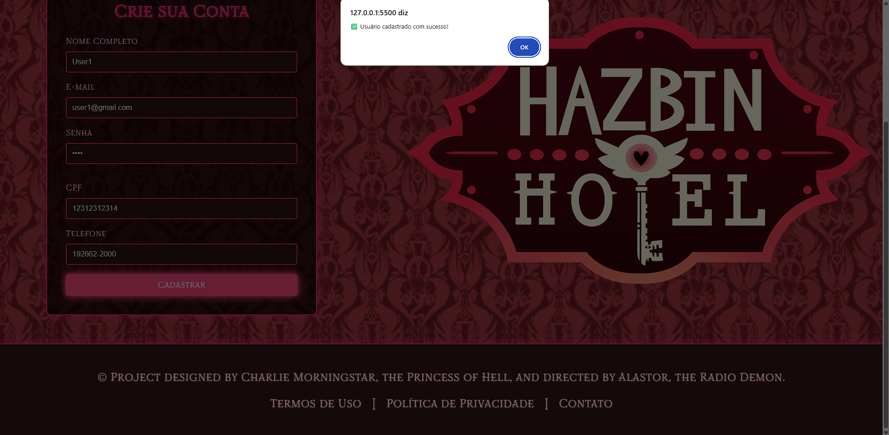
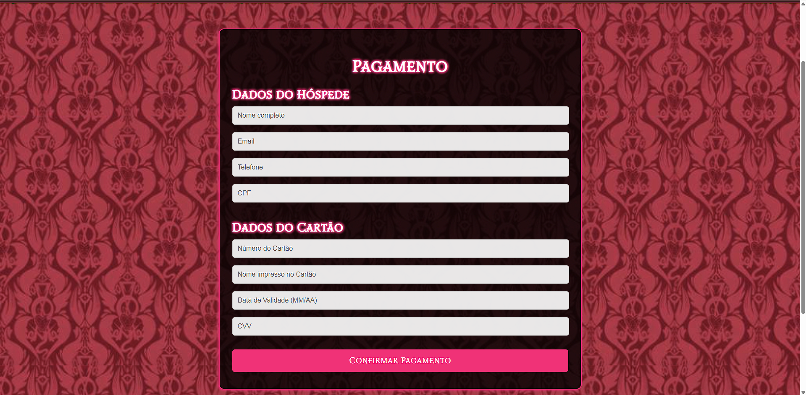
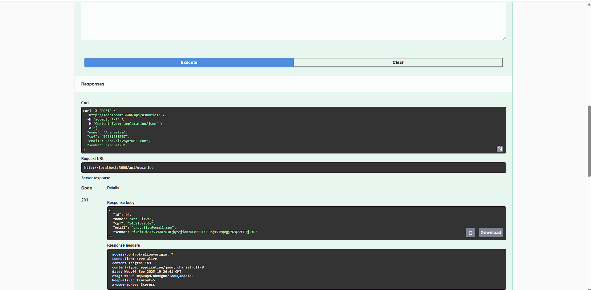
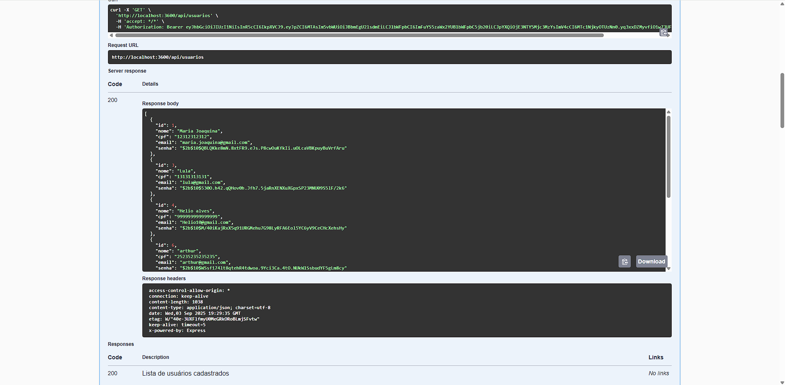
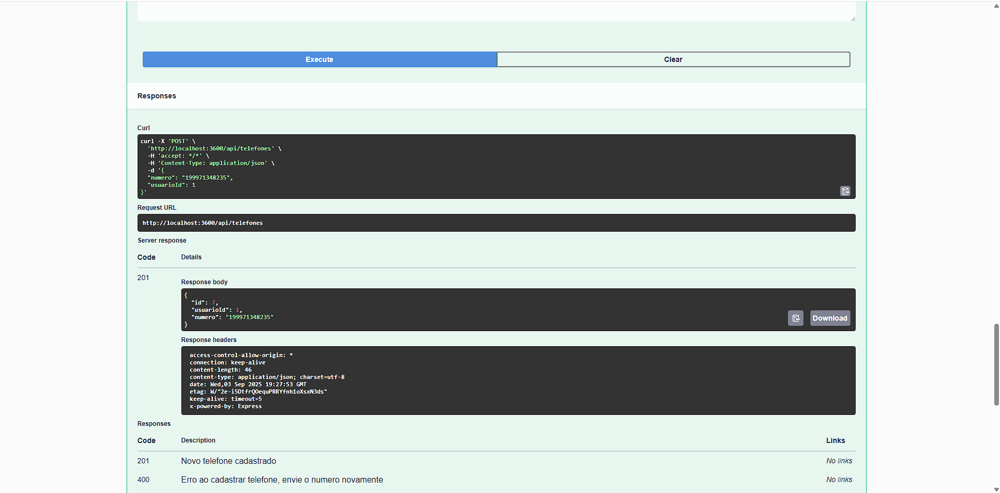
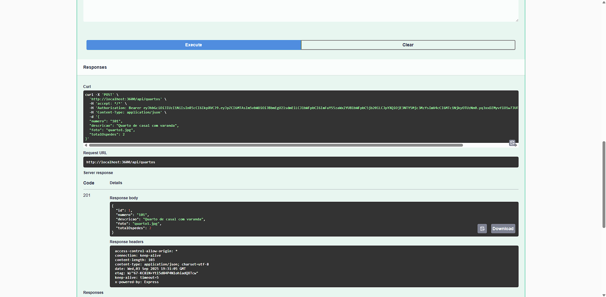
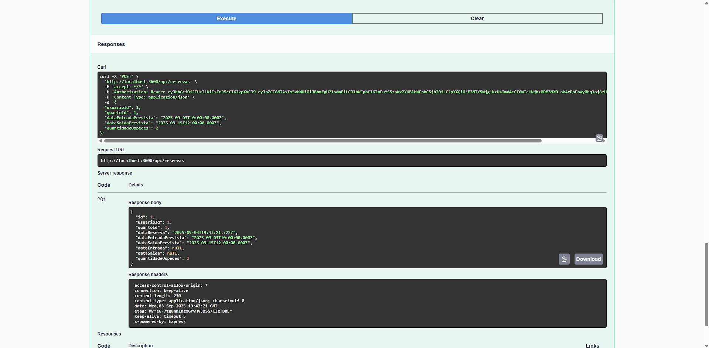
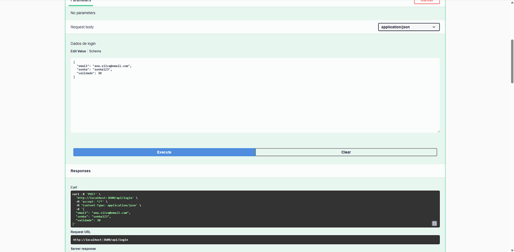

# 🏨 Hazbin Hotel

Bem-vindo ao projeto **Hazbin Hotel**! Este é um sistema completo para gerenciamento de hotel, com interface web para clientes e administração, desenvolvido por uma equipe dedicada de estudantes.

## 📸 Imagens Promocionais

Veja algumas imagens de nossa instalação:

<p align="center">
  
  <br>
  
  <br>
  
</p>

## 👨‍💻 Equipe de Desenvolvedores

Conheça quem fez este projeto acontecer:

<p align="center">
  
  
  
  
</p>

- **Jessé** – Front-end
- **Vitinho** – Front-end
- **Arthur** – Front-end
- **Diego** – Back-end

## 📂 Estrutura do Projeto

```
api/
back/
front/
  css/
  html/
  images/
```

- **front/**: Interface web do projeto (HTML, CSS, imagens)
- **back/**: Lógica de backend (Node.js)
- **api/**: Endpoints de API

## 🚀 Como rodar o projeto

1. Clone este repositório.
2. Abra o arquivo [`../front/html/pagina_inicial.html`] no seu navegador para acessar a interface principal.

## 💡 Funcionalidades

- Reservas de quartos
- Avaliações de hóspedes
- Pagamento online
- Página de contato e localização
- Galeria de eventos

## 🏨 Sobre o Hazbin Hotel

O Hazbin Hotel é o lugar perfeito para quem busca uma experiência única e inesquecível. Oferecemos uma ampla gama de serviços e comodidades, incluindo quartos confortáveis, restaurantes deliciosos, entretenimento ao vivo e muito mais.


## Testes realizados

### Teste de cadastro e login



### Teste de pagamento


### Testes da Api







---

<p align="center">
  
</p>